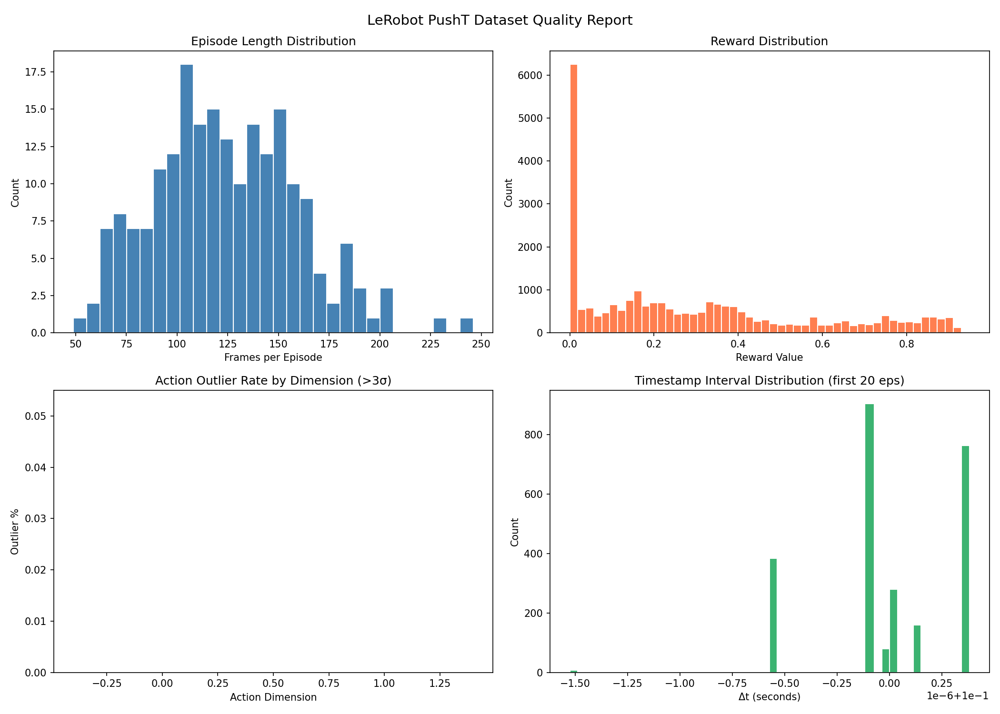

# LeRobot PushT Data Quality Analysis

A data quality inspection pipeline for robot manipulation datasets in LeRobot format, targeting embodied AI training data validation.

## Dataset

[lerobot/pusht](https://huggingface.co/datasets/lerobot/pusht) — a 2D push-T task dataset collected via human teleoperation, commonly used for imitation learning and reinforcement learning research.

- 25,650 frames across 206 episodes
- Modalities: state, action, timestamp, reward
- Format: Parquet (HuggingFace Datasets)

## Quality Checks

| Check | Description | Result |
|---|---|---|
| Missing values | Null detection across all fields | ✅ 0 missing |
| Episode continuity | Frame index gaps within episodes | ✅ 0 issues |
| Timestamp consistency | Monotonicity within episodes | ✅ 0 issues |
| Action anomalies | Per-dimension outlier detection (>3σ) | ✅ <0.05% outliers |
| Reward distribution | Zero-reward and positive-reward ratio | 19.2% zero / 80.8% positive |
| Episode length | Distribution and abnormal length detection | mean=124, std=35 |

## Results



### Key Findings

- Dataset is structurally clean: no missing values, no frame gaps, no timestamp inversions within episodes
- Reward distribution shows a spike at 0 (19.2% of frames), reflecting early-episode exploration before the T-block reaches the target zone
- Action outlier rate is extremely low (<0.05% per dimension), indicating consistent teleoperation quality
- Episode lengths follow a roughly normal distribution (mean≈124 frames), with a small number of longer episodes up to 245 frames

## Usage
```bash
pip install datasets pandas numpy matplotlib
python quality_check.py
```

Output files are saved to `output/`:
- `quality_dashboard.png` — 4-panel visualization
- `quality_report.json` — full check results in JSON

## Environment

- Python 3.10
- datasets, pandas, numpy, matplotlib